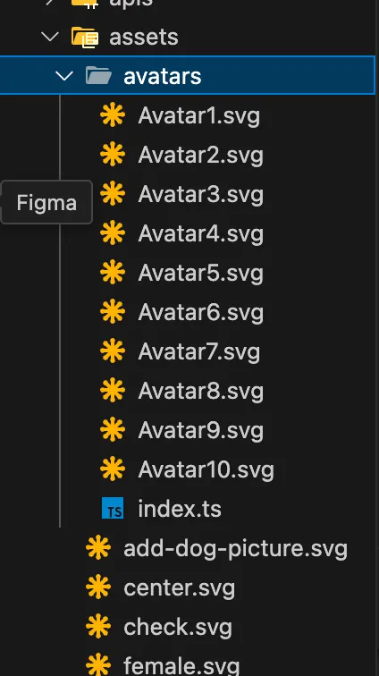
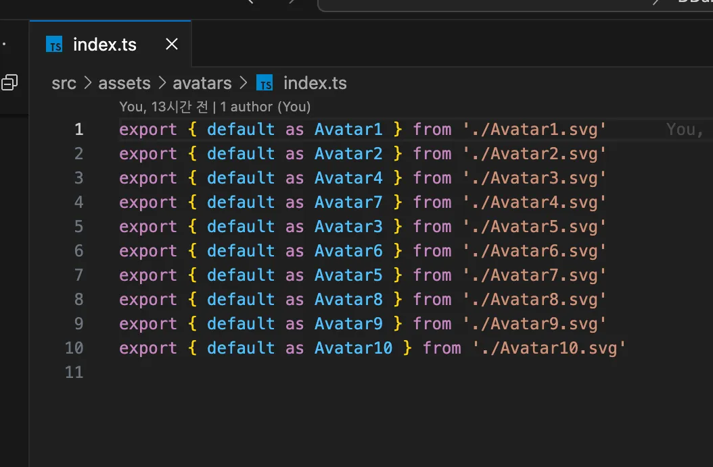
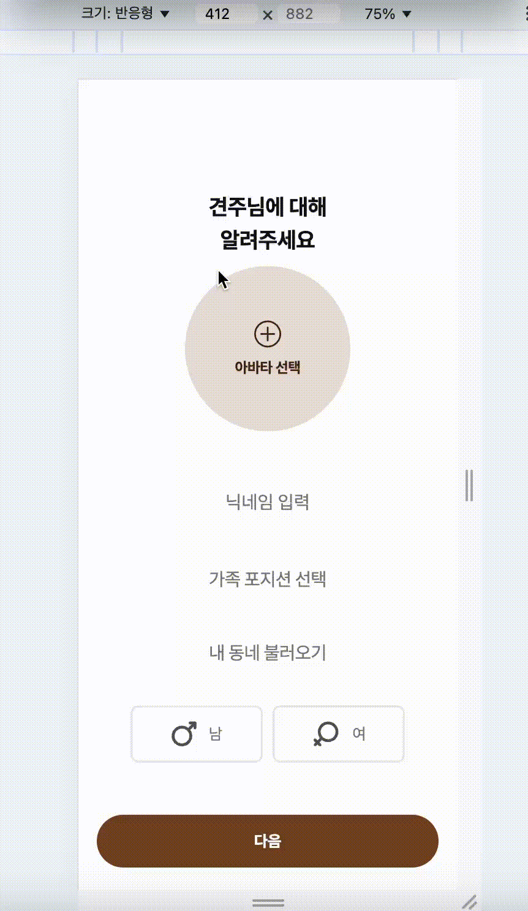

Barrel export 패턴 적용해서 import 깔끔하게 정리하기

# 문제상황

DDang 프로젝트 구현 중, 회원가입 페이지를 퍼블리싱 하는데 아바타 svg 등록 관련해서 Barrel 패턴을 적용한 것을 기록하고자 한다.

견주 정보 입력에 아바타 등록 모달에서 10개의 아바타 svg 파일을 import 해야 하는 상황. 하나씩 import 하니… 똑같은 코드로 10줄이 최상단에 다라락 나오는 것이 불편해 보였다.

React 컴포넌트에서 10개의 SVG 아바타 파일을 각각 import 해야 하는 상황에서 발생하는 코드 중복과 가독성 문제를 Barrel 패턴을 적용하여 해결하고자 했다.

# **해결 방안: Barrel 패턴 적용**

## Barrel 패턴이란?

Barrel 패턴은 여러 모듈의 export를 하나의 진입점(entry point)으로 통합하여 관리하는 패턴이다.

## **기본 구조**

**구현 방식**

- 특정 폴더에 index.ts(또는 index.js) 파일을 생성한다.
- 이 파일에서 해당 폴더의 다른 파일들을 re-export 한다.

## **장점**

- **간결한 import**: 여러 파일을 개별적으로 import하지 않고 하나의 경로에서 가져올 수 있습니다
- **유지보수성**: 파일 구조가 변경되어도 import 문을 수정할 필요가 없다. 
- **코드 정리**: 관련된 컴포넌트나 모듈을 논리적으로 그룹화할 수 있다. 

### **1. 파일 구조 최적화**


우선 svg 파일을 모아놓는 assets폴더에 avatars 하위 폴더를 하나 더 생성하고 Avatar1~10을 모조리 넣는다. 

avatars 폴더 내부에 index.ts 파일을 하나 생성하여 해당 파일에 10개의 import를 모아서 한꺼번에 export한다.

import 하는 입장에서는 지저분하게 경로마다 import 하는것이 아니라

index.ts에서 일괄적으로 export한 것을 받아서 사용하면 더 import 문이 깔끔하다.

```jsx
assets/
  └── avatars/
      ├── Avatar1.svg
      ├── Avatar2.svg
      └── index.ts
```
<br><br>
### **2. Barrel 파일 구현**




인덱스 파일을 코드는 다음과 같다. 
<br>
## 3. 적용

**1. 아바타 import 및 변환**

이제 RegisterAvatarModal 디렉의 index.tsx 파일에 적용시킬 것이다.

```jsx
import * as avatars from '~/assets/avatars'
const avatarImages: string[] = Object.values(avatars)
```

`Object.values()`를 사용하여 모든 아바타 모듈을 배열로 변환한다. 이는 각 SVG 파일의 default export를 문자열(URL)형태로 포함하는 배열을 생성한다.
<br>

**2. 렌더링 구현**

오브젝트로 변환한 후

avatars 객체의 모든 값들을 배열로 변환하면, 각 SVG 파일의 URL 문자열이 배열의 요소로 들어가게 된다. 이렇게 변환된 배열을 map 함수로 순회하면서 각 아바타 이미지를 렌더링할 수 있다.

```jsx
{avatarImages.map((avatar, index) => (
          <S.CharacterArea key={index} index={index} onClick={() => handleSelectAvatar(index)}>
            
            {selectedAvatar === index && (
              <S.SelectOverlay>
                <S.CheckIcon>
                  <S.CheckPath />
                </S.CheckIcon>
              </S.SelectOverlay>
            )}
          </S.CharacterArea>
        ))}
```

이때 아바타가 Avatar1, Avatar2 순서대로 렌더링 되지 않는다. 

그 이유는 `Object.values()`가 객체의 프로퍼티를 열거할 때 속성 추가 순서를 보장하지 않기 때문이다. Javascript 엔진의 객체 프로퍼티 열거 방식에 따라 순서가 결정된다. 

만약 순서를 보장하고 싶다면 다음과 같은 방법을 사용하면 된다!

```jsx
const avatarKeys = Object.keys(avatars).sort()
const sortedAvatarImages = avatarKeys.map(key => avatars[key])
```

Object.keys()로 avatars 객체의 키들을 먼저 추출한 후 sort()로 정럴하면 Avtar1, Avatar2 와 같이 이름 순서대로 정렬된 키 배열을 얻을 수 있다. 

이 정렬된 키 배열을 map으로 순회하면서 각 키에 해당하는 아바타 이미지를 가져오면 원하는 순서대로 아바타를 랜더링 할 수도 있다.

이렇게 Barrel 패턴을 이용해서 효과적으로 코드를 줄일 수 있다. 

<br><br>

하진만, 대규모 프로젝트에선 지양하도록 하자. Barrel 파일이 다른 Barrel 파일을 import하는 구조가 되면, 프로젝트의 모든 파일을 불필요하게 로드하게 될 수 있다.

## **Barrel 패턴의 단점**

1. **Tree Shaking 영향**:
    - Barrel 파일을 통한 export/import는 웹팩의 Tree Shaking을 방해할 수 있다.
    - 사용하지 않는 모듈도 번들에 포함될 수 있다.
2. **번들 사이즈** : 대규모 프로젝트에서는 Barrel 파일 간의 중첩된 import로 인해 번들 사이즈가 증가할 수 있다.
3. **순환 종속성**: 잘못 사용하면 순환 종속성 문제가 발생할 수 있다

```jsx
// 개별 파일들
// components/Button.ts
export const Button = () => {...}

// components/Input.ts
export const Input = () => {...}

// Barrel 파일 (components/index.ts)
export * from './Button'
export * from './Input'

// 사용하는 곳
import { Button, Input } from './components'
```
<br><br>
# 성능저하?

Barrel 패턴을 적용하는 것은 위에 설명한 대로 많은 장점이 있지만,

**성능적 측면에선 부정적인 영향을 미칠 수 있다**

### **성능 저하 원인**

- **번들 크기 증가**: Barrel 파일을 사용하면 실제로 사용하지 않는 모듈까지 포함되어 번들 크기가 커질 수 있다
- **모듈 그래프 복잡성**: Barrel 파일이 다른 Barrel 파일을 import하는 구조가 되면, 프로젝트의 모든 파일을 불필요하게 로드하게 될 수 있다
- **로딩 시간 증가**: 불필요한 추가적인 파일을 로드하고 처리해야 하므로 애플리케이션의 성능이 저하될 수 있다

실제 사례로 한 프로젝트에서 Barrel 파일을 제거한 후 프로덕션 빌드 크기가 752.86kB에서 186.11kB로 크게 감소했고 한다.

( https://dev.to/tassiofront/barrel-files-and-why-you-should-stop-using-them-now-bc4 )
따라서 Barrel 패턴은 코드 구조화와 가독성 측면에서는 장점이 있지만, 성능 최적화 관점에서는 오히려 부정적인 영향을 미칠 수 있으므로 신중하게 사용해야 한다.

나는 프로젝트 규모가 그렇게 크지 않아서 적용시켜 보았다.

<br><br>

<div style="display: flex; justify-content: center;">
  
  
</div>


svg 파일 가져와서 UI 깔끔하게 완성!